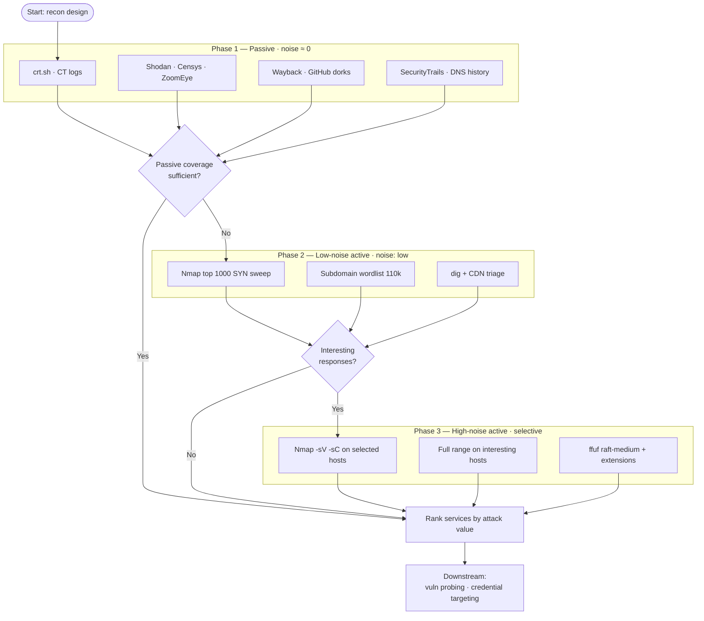

## 概要

偵察の質はツールの熟達ではなく、事前設計で決まる — という前提から出発し、あらゆる reconnaissance に効く 4 つの軸 (カバレッジ / 深さ / ノイズ / 時間) を整理した記事。この 4 軸は同時に最大化できず、常に 2 つを取って 2 つを諦めるトレードオフになる。時間予算が他 3 軸の起点になる理由、CTF / ペンテスト / レッドチーム / バグバウンティで最適解が桁単位に変わる話、そして同じフレームを反転させると防御側の監視設計に応用できる話を書いた。具体的なコマンドや wordlist は `/refs/reconnaissance` にまとめてある。

## Introduction

Most reconnaissance material — books, courses, blog posts — focuses on tools. This scanner, that fuzzer, this new subdomain enumerator. Very little of it addresses the more fundamental question: why are you running that tool, with those options, against that target, right now?

CTF veterans in particular tend to overlook this gap. In a CTF, scope is small and fixed. The target is one box. Time limit is 24 hours. Nobody's going to walk in and tell you `nmap -sV -sC -p- --min-rate 10000` was inappropriate for the engagement. So mastery of tool syntax gets conflated with mastery of reconnaissance itself.

That model doesn't survive contact with real environments. Time is scarce, scope shifts, detection is live. Running CTF-grade scans against every host in scope means the engagement window closes before you finish the interesting work. On a red team, leaving traces is the failure mode, not missing a service. On bug bounty, you're racing other hunters and the calculus of coverage-versus-speed inverts again.

Reconnaissance quality gets decided in the design phase, before any command runs. This piece is about how to think through that design. The actual commands and wordlists live in `/refs/reconnaissance`.

## The Four Axes

Reconnaissance moves along four axes. Like the classic iron triangle in project management, you can't maximize all four at once. Pick which to optimize and decide what to give up before you start running things.

**Coverage** is how much of the attack surface you look at. All 65,535 ports or the top 1000? Every subdomain the organization has ever registered or just the mainline hosts? The full page graph or just what's linked from index?

**Depth** is how much detail per finding you go after. Just "port open," or service name, or version, or automatically cross-referenced against known CVEs? For subdomains: just hostnames, or full tech-stack fingerprinting on each one?

**Noise** is how much footprint you leave in the target environment. Fully passive OSINT means the target doesn't know you exist. `--min-rate 10000` across the full port range means their perimeter IDS will alert within seconds.

**Time** is wallclock from scan start to results in hand. Full port range at `-T2` takes hours; at `--min-rate 10000` it takes minutes. Subdomain enumeration is minutes for passive-only, hours for a 10M-word DNS bruteforce.

## The Trade-offs

These four axes aren't independent. Pushing one up almost always pulls another down.

- Maximize coverage AND depth: time and noise both blow up.
- Maximize coverage AND speed: depth gets thin, or noise spikes hard.
- Combine stealth AND depth: coverage shrinks, time extends.
- Combine speed AND stealth: coverage and depth both get gutted.

Some version of "pick two, sacrifice two" silently governs every scan anyone has ever run. The difference between silent and explicit sacrifice is the difference between a clean recon phase and one you spend hours cleaning up after.

## Time as the Primary Constraint

Of the four axes, time is the most binding — because the other three can partially be bought with time. Not enough coverage? Spend more time and widen the sweep. Not enough depth? Come back with follow-up probes. Too noisy? Slow down.

Time is the only axis you can't substitute for. Deciding how much time reconnaissance gets is what makes the other three decidable at all.

Time budgets vary by orders of magnitude across engagement types:

_The four axes made explicit for each engagement type. CTF is pointed toward depth (need every service detail on a single box); red team stretches vertically (need time and stealth above all); standard pentest is roughly balanced across all four; bug bounty leans right (coverage-first, everything else secondary)._

**CTF (Hack The Box, TryHackMe)**: One target, expected solve time of a few hours. Practical recon budget is 10–30 minutes. If you haven't found your foothold in that window, you're out of time for the actual exploitation work. Top 1000 ports plus service versioning plus basic content discovery is the standard compromise. Anything more elaborate cuts into exploitation time.

**Standard pentest**: A few to a few dozen targets, one to two weeks of engagement. Recon takes day one and often bleeds into day two. Scope-wide port scan, service enumeration, and subdomain sweep, executed within whatever noise level the statement of work permits. You have room to be thorough but not room to be leisurely.

**Red team**: Organization-wide scope, weeks to months of duration. Recon spreads across weeks. The unit isn't "30% of scope covered in a day" but "1% of scope per day for 30 days." Detection avoidance dominates every other consideration. Whatever stealth time can buy, you buy.

**Bug bounty**: Unlimited timeline in principle, bounded by the fact that competing hunters will find things first. Practical budget is hours to days. Two viable strategies coexist: narrow the scope aggressively and dig deep, or spray wide and filter afterward.

The same tool against the same target has a completely different correct invocation across these four contexts. Running CTF-grade recon against a corporate pentest scope is how engagements burn out. Bringing red-team caution to bug bounty is how you lose the queue to someone less careful and more available.

There's a common trap in the transitions between these contexts. Habits calibrated in one environment travel poorly into another where the constraints are inverted. Someone who trained on CTFs treats their aggressive scan invocation as a signature move, then generates more alerts in twenty minutes of a pentest than the SOC handles in a normal week. Someone who trained on red team treats every packet as a risk, then never fires enough shots on bug bounty to find anything before the queue moves on. Recognizing which time budget you're actually working in — not the one you trained in — is what most transitions between engagement types actually require.

## Example: Port Scanning

Port scanning is where the four axes are most visible.

**Top 100 vs. top 1000 vs. full range**: Nmap without `-p` scans the top 1000 ports per protocol, drawn from `nmap-services` frequency data. Fyodor's published statistics show this covers approximately 93% of TCP ports found open in real-world scans. `-F` (top 100) covers 78%. Reaching 90% coverage requires 576 ports. That's the shape of the curve: a 10× jump from top 100 to top 1000 buys 15 percentage points; going from top 1000 to full range (another 65×) buys 7 more. Meanwhile the wallclock cost grows in proportion to port count, not coverage.

_Coverage curve (green, solid) saturates fast; wallclock time cost (amber, dashed) grows linearly. Past the default top 1000, the gap widens dramatically: adding 65× more ports buys only 7 percentage points of coverage. Source: Fyodor, Nmap Network Scanning._

Once you see the curve, the choices become clear. Single CTF box: full range is worth it, because the remaining 7% often contains the "hidden management interface" the challenge was designed around. Standard pentest with dozens of hosts: top 1000 for the sweep, escalate to full range only on hosts that show promising services. Red team: full range distributed across days or weeks at very low rates, because time is cheap and detection is expensive.

**`--min-rate` and detection**: `--min-rate 10000` is fast, but the packet density trips SYN flood and rate-based detectors on most modern firewalls. Push toward stealth and you land in the single-digit pps range, which translates to hours or days of wallclock time. There is no universal "safe" rate. The actual threshold depends on the target's detection tuning, telemetry granularity, and SOC response bandwidth. In practice you estimate it from passive OSINT and prior context, then work backwards to derive an operational rate.

**Service version detection**: `-sV` sends additional probes to every open port. From a detection standpoint this reads as "port scan followed by suspicious probing," which typically escalates alert priority. Depth costs noise.

**Passive → active**: Shodan, Censys, and ZoomEye maintain databases of what everyone else has observed when scanning the same IP space. You extract intelligence about the target without sending a single packet. Noise is literally zero. Query these first, then use what's already visible to narrow your active scan scope. Result: narrower active coverage, comparable effective coverage. Caveat: passive database entries can be days to weeks stale, so treat them as leads to verify, not conclusions to rely on.

_Passive-first flow structured as 3 phases with increasing noise cost. Escalation between phases is gated by explicit decisions — coverage sufficiency after passive, and response quality after low-noise active. Skipping straight to Phase 3 is what CTF habits produce; Phase 3 activity should always be scoped by what earlier phases surfaced._

## Example: Subdomain Enumeration

**Passive-first**: Certificate transparency logs (crt.sh), DNS history (SecurityTrails, DNSDumpster), search engines, public GitHub repositories, Wayback Machine. All of these pull subdomains without touching the target's infrastructure. In practice most of an organization's subdomains surface through passive sources — but the ratio varies widely based on how much the target exposes to the public internet. Exhaust passive first. Then decide whether active bruteforce is worth the noise budget it costs.

**Wordlist selection**: SecLists' `subdomains-top1million-110000.txt` has 110k entries and finishes in five to ten minutes against most environments. Going larger has sharply diminishing returns. A better move for many targets: build a 100-word custom list from the organization's naming conventions (company abbreviation, environment tags, product code names) and outperform any generic large list.

**Resolution branching**: A subdomain that resolves behind a CDN has different attack value than one pointing at an origin server. As a depth calibration, resolve every hit with `dig +short`, bucket by CDN IP ranges vs. self-hosted ranges, and prioritize accordingly for the downstream scanning phase.

## Example: Web Content Discovery

**Common wordlists**: SecLists' `raft-medium-directories.txt` (30k entries) is a defensible first choice for content discovery on most web applications. It exploits the statistical bias that most frameworks reuse the same conventional paths — `/admin`, `/login`, `/api`, and similar.

**Extensions**: Adding `--extensions php,asp,aspx,jsp` effectively multiplies the wordlist by five. If you already fingerprinted the tech stack, trim to only the relevant extensions and reclaim the time. This is why running nikto or whatweb ahead of content discovery isn't optional.

**Rate and WAF**: `-t 100` in ffuf runs fast but frequently trips Cloudflare, Akamai, and AWS WAF at L7. Once tripped, you're IP-blocked for 30 minutes to several hours, and every subsequent response is corrupted: all 403s, or challenge pages, or silent nulls. This is the textbook case of coverage bought with speed getting refunded as noise. Start at 20 to 50 threads, watch the response pattern, escalate only if the target shows headroom.

## Timing You Don't Run

Recon design includes decisions about when not to run.

- If the statement of work specifies "minimize noise during business hours," concentrate active scanning into off-hours. This isn't just a courtesy; it changes the detection profile.
- If passive OSINT surfaces anything about the target's SOC coverage model, work around their observable windows — or into them, depending on strategy.
- Maintenance windows (Patch Tuesday plus one day, quarter-end release freezes) are worse windows for stealth, not better. The environment is already unstable, so any additional deviation stands out sharper.
- CTF and lab environments invert all of this: run at full speed constantly, because there is nothing to hide from. Even "no timing constraint" is itself a timing decision.

MITRE ATT&CK's T1595 (Active Scanning) documents the defender's perspective on how these timing patterns get detected. The attacker's move is to design activity that lands outside whatever observation window the defender has built for themselves.

## Design Before Tools

The most common trajectory for people not improving at reconnaissance is treating "learn another tool" as equivalent to improvement. Rustscan, massscan, nuclei, subfinder, amass, gau, waybackurls, httpx. Fluency with individual tools isn't wasted, but it's the second-order question.

The first-order question is what information you're trying to acquire, and that's decided by the four axes. Pick your axes explicitly first, then pick the tools that satisfy those choices. Doing it in reverse — starting from the tool and rationalizing the design afterward — is how you end up with failures like "I ran rustscan fast and missed the legacy port range that mattered."

A realistic progression looks like this:

1. Develop the four-axis mindset with basic, well-understood tools. Nmap, gobuster, and curl are enough for this phase.
2. Calibrate within each axis — `--top-ports` values, wordlist selection, `--min-rate` tuning — based on how targets actually respond in the environments you work in. This skill is independent of which specific tool you happen to be using.
3. Add faster, quieter, or deeper tools as specific goals require them. Rustscan for speed. Httpx for probing flexibility. Nuclei for automated depth.

Jumping directly to (3) is what produces the "I have all the tools but the results aren't there" pattern. The tools are downstream of the design; the design is what actually moves.

## The Defender's Mirror

The four-axis frame maps cleanly onto detection design on the defensive side.

- **Coverage**: How much of the organization's asset inventory has an EDR agent installed? Sysmon deployment rate? Full packet capture at the perimeter?
- **Depth**: How much metadata gets recorded per event? Process creation only, or full command line, or full parent process chain?
- **Noise**: Daily false-positive count. Analyst fatigue is exactly what happens when the noise budget gets exceeded.
- **Time**: MTTD (Mean Time To Detect) budget. Is the target 30-minute detection or 24-hour detection?

Anyone who can read the offensive four-axis tradeoffs can read the defensive ones with the same vocabulary. Questions like "why doesn't this organization see attack surface X" or "why didn't they catch attack timing Y" can usually be explained as misallocations of the defender's four axes. Treating offense and defense as one subject means sharing this vocabulary across both sides, and that's when the analysis actually gets sharp.

There's a diagnostic value to the mirror as well. When a defensive incident report says "we didn't catch this," walking through the four axes identifies which one absorbed the miss. Was initial recon missed because coverage was thin? Was credential access missed because depth wasn't recording process ancestry? Was the intrusion caught but too late because MTTD was set for a different attack stage? These are structurally different failures, and collapsing them all into "detection gap" erases the information needed to fix any of them.

## Key Takeaways

- Recon quality gets decided in the design phase, before any command runs. Pick which two of the four axes (coverage, depth, noise, time) you're optimizing, and which two you're sacrificing, explicitly.
- Time is the leading variable because it's the only axis you can't substitute for. CTF, pentest, red team, and bug bounty have time budgets that differ by orders of magnitude, and each demands a different design.
- Nmap's default top 1000 covers roughly 93% of TCP ports found open in practice. Top 100 covers 78%. Hitting 90% takes 576 ports. Choose `--top-ports` with that curve in mind.
- Subdomain enumeration is passive-first. Exhaust the passive sources before deciding whether active bruteforce is worth the noise budget it costs.
- Web content discovery is where speed-bought coverage gets refunded as noise. WAF trips corrupt every downstream response.
- There is no universal rate that "won't get detected." The threshold depends entirely on target detection tuning. Estimate it from passive OSINT of the target, then work backwards.
- Timing you don't run is part of the design. Read the defender's observation windows via passive OSINT and land outside them.
- The learning progression is four-axis mindset first, per-axis calibration second, tool expansion third. Reversing this order distorts recon by tool choice rather than by target need.
- The same four axes describe defensive monitoring design. Fluency in one gives you fluency in the other.

## References

- MITRE ATT&CK — TA0043 Reconnaissance: <https://attack.mitre.org/tactics/TA0043/>
- MITRE ATT&CK — T1595 Active Scanning: <https://attack.mitre.org/techniques/T1595/>
- MITRE ATT&CK — T1596 Search Open Technical Databases: <https://attack.mitre.org/techniques/T1596/>
- Nmap Network Scanning — Port Selection Data and Strategies: <https://nmap.org/book/performance-port-selection.html>
- Nmap Network Scanning — Timing and Performance: <https://nmap.org/book/man-performance.html>
- OWASP Web Security Testing Guide — Information Gathering: <https://owasp.org/www-project-web-security-testing-guide/latest/4-Web_Application_Security_Testing/01-Information_Gathering/>
- SecLists — Discovery/Web-Content: <https://github.com/danielmiessler/SecLists/tree/master/Discovery/Web-Content>

---

> 我以外皆我師 — everyone I meet has something to teach me.
